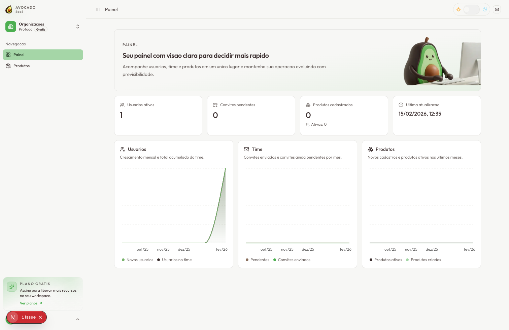

# avocado SaaS Starter

Template SaaS com:

- Next.js (App Router)
- Better Auth (email/senha)
- Multi-tenant por organizacao
- Convites e gestao de equipe
- Prisma + PostgreSQL

## Preview



## Setup local (ativar no computador)

### 1) Pre-requisitos

- Node.js 20+
- pnpm 9+ (via Corepack)
- Docker + Docker Compose
- Git

### Docker (se ainda nao tiver instalado)

1. Instale o Docker:
- macOS/Windows: Docker Desktop
- Linux: Docker Engine + Docker Compose Plugin
2. Inicie o Docker (o daemon precisa estar ativo).
3. Valide no terminal:

```bash
docker --version
docker compose version
```

### 2) Clonar e instalar dependencias

```bash
git clone <url-do-seu-repositorio>
cd avocado-saas-starter
```

Depois instale as dependencias:

```bash
corepack enable
pnpm install
```

### 3) Criar arquivo `.env`

```bash
cp .env.example .env
```

Depois, preencha no `.env` as variaveis da tabela abaixo (principalmente as keys de integracao).

No arquivo `.env`, mantenha as URLs locais assim durante desenvolvimento:

```bash
BETTER_AUTH_BASE_URL=http://localhost:3000
BETTER_AUTH_URL=http://localhost:3000
NEXT_PUBLIC_BETTER_AUTH_URL=http://localhost:3000
NEXT_PUBLIC_SITE_URL=http://localhost:3000
TRUSTED_ORIGINS=http://localhost:3000
```

### 4) Onde pegar cada key

| Variavel | Obrigatoria para rodar local | Onde pegar |
| --- | --- | --- |
| `BETTER_AUTH_SECRET` | Sim (recomendado) | Gere localmente com: `openssl rand -base64 32` |
| `RESEND_API_KEY` | Sim para fluxo completo de cadastro/login por e-mail | Painel Resend: [API Keys](https://resend.com/docs/dashboard/api-keys/introduction) |
| `RESEND_FROM_EMAIL` | Sim junto com `RESEND_API_KEY` | Endereco remetente do seu dominio verificado em [Domains (Resend)](https://resend.com/docs/dashboard/domains/introduction). Em testes, pode usar `Acme <onboarding@resend.dev>` |
| `ABACATEPAY_API_KEY` | Nao (apenas billing/checkout) | Painel AbacatePay, secao Integracao/Autenticacao: [docs](https://docs.abacatepay.com/pages/authentication) |
| `ABACATEPAY_WEBHOOK_SECRET` | Nao (apenas webhook do billing) | Defina ao criar webhook no painel da AbacatePay e replique no `.env`: [docs](https://docs.abacatepay.com/pages/webhooks) |
| `ABACATEPAY_WEBHOOK_SIGNATURE_KEY` (ou `ABACATEPAY_PUBLIC_KEY`) | Nao (recomendado para seguranca do webhook) | Chave de assinatura/publica exibida na configuracao de webhook da AbacatePay: [docs](https://docs.abacatepay.com/pages/webhooks) |
| `GOOGLE_CLIENT_ID` + `GOOGLE_CLIENT_SECRET` | Nao (login Google) | Google Cloud Console > APIs & Services > Credentials > OAuth Client ID (Web Application): [guia](https://support.google.com/googleapi/answer/6158849?hl=pt-BR) |
| `CLOUDINARY_CLOUD_NAME`, `CLOUDINARY_API_KEY`, `CLOUDINARY_API_SECRET` | Nao (upload de avatar/logo) | Painel Cloudinary > Settings > API Keys: [guia](https://cloudinary.com/documentation/django_integration#configure) |

Observacoes importantes:

- Sem `RESEND_API_KEY` e `RESEND_FROM_EMAIL`, os e-mails transacionais nao sao enviados (verificacao de conta, convite e reset de senha).
- Sem `ABACATEPAY_API_KEY`, o app sobe normalmente, mas checkout de planos pagos fica indisponivel.
- Sem chaves da Cloudinary, apenas upload de avatar/logo falha.

### 5) Subir banco e Prisma

```bash
pnpm run db:setup
```

Esse comando faz:

1. `docker compose up -d postgres`
2. `prisma generate`
3. `prisma db push`

Comandos Docker uteis para o banco:

```bash
pnpm run db:up
pnpm run db:logs
pnpm run db:down
```

### 6) Rodar o projeto

```bash
pnpm run dev
```

Abra [http://localhost:3000](http://localhost:3000).

### 7) Primeiro acesso (checklist rapido)

1. Acesse `/sign-up` e crie uma conta.
2. Confirme o e-mail recebido (Resend).
3. Faca login em `/sign-in`.
4. Conclua o onboarding da empresa.

## Problemas comuns no setup local

### Porta do Postgres em uso (5432)

Suba o banco em outra porta:

```bash
POSTGRES_PORT=5433 pnpm run db:up
```

Depois ajuste o `DATABASE_URL` no `.env` para a mesma porta.

### Sem Docker

Se voce nao usar Docker, rode um PostgreSQL local/manual e ajuste `DATABASE_URL`.
Depois execute:

```bash
pnpm run prisma:generate
pnpm run prisma:push
```

## Deploy na Vercel

1. Importe o repositorio na Vercel e mantenha framework como `Next.js`.
2. Configure variaveis em `Project Settings > Environment Variables`:
- `DATABASE_URL` (recomendado: banco gerenciado com pool de conexoes)
- `BETTER_AUTH_SECRET` (minimo de 32 caracteres)
- `BETTER_AUTH_URL` e `NEXT_PUBLIC_BETTER_AUTH_URL` (ex.: `https://app.seudominio.com`)
- `NEXT_PUBLIC_SITE_URL` (dominio canonico publico, ex.: `https://app.seudominio.com`)
- `TRUSTED_ORIGINS` (dominios permitidos, separados por virgula)
- `RESEND_API_KEY`, `RESEND_FROM_EMAIL`
- `ABACATEPAY_API_KEY`, `ABACATEPAY_WEBHOOK_SECRET` e opcionalmente `ABACATEPAY_WEBHOOK_SIGNATURE_KEY` (ou `ABACATEPAY_PUBLIC_KEY`)
- `ABACATEPAY_TIMEOUT_MS` (opcional), `ABACATEPAY_BILLING_LIST_TIMEOUT_MS` (opcional), `ABACATEPAY_BILLING_LIST_RETRIES` (opcional)
- `CHECKOUT_PENDING_TIMEOUT_MINUTES` (opcional)
- `CLOUDINARY_CLOUD_NAME`, `CLOUDINARY_API_KEY`, `CLOUDINARY_API_SECRET`
- `CLOUDINARY_PROFILE_FOLDER` (opcional), `CLOUDINARY_ORGANIZATION_FOLDER` (opcional)
3. O build ja esta preparado para Vercel:
- `pnpm run build` executa `prisma generate` antes do `next build`.
- `postinstall` tambem executa `prisma generate` para evitar client Prisma desatualizado em cache de build.
4. Para mudancas de schema em producao, prefira migracoes:

```bash
pnpm run prisma:migrate:deploy
```

5. Fallback de URL na Vercel:
- Se `BETTER_AUTH_URL` nao estiver definida, o projeto tenta usar variaveis de sistema da Vercel (`VERCEL_URL` e relacionadas).
- Em producao com dominio proprio, mantenha `BETTER_AUTH_URL` explicita para evitar callback incorreto em auth.

## Login com Google (opcional)

- O botao de login com Google ja fica disponivel em `/sign-in`.
- Para funcionar, configure `GOOGLE_CLIENT_ID` e `GOOGLE_CLIENT_SECRET`.
- URI de redirecionamento em desenvolvimento:
  - `http://localhost:3000/api/auth/callback/google`
- Em producao:
  - `https://seu-dominio.com/api/auth/callback/google`

## Rotas principais

- `/sign-in`
- `/sign-up`
- `/forgot-password`
- `/reset-password`
- `/onboarding/company`
- `/dashboard`
- `/billing`
- `/profile`

## Billing / Webhooks

- O billing fica em `/billing` (planos por organizacao, trial, upgrade/downgrade, cancelamento, reativacao, faturas).
- Webhook AbacatePay: `POST /api/webhooks/abacatepay` com header `X-Webhook-Secret: SEU_SEGREDO`.
- O webhook valida `X-Webhook-Secret`, valida obrigatoriamente `X-Webhook-Signature` (HMAC SHA-256) e aplica idempotencia por `event.id`.
- Se `ABACATEPAY_WEBHOOK_SIGNATURE_KEY`/`ABACATEPAY_PUBLIC_KEY` nao estiver configurada, o webhook valida apenas o secret (modo compatibilidade).
- O webhook aplica rate limit por IP e pode restringir origem com allowlist (`ABACATEPAY_WEBHOOK_ALLOWED_IPS`).
- O checkout so aceita redirecionamento para hosts confiaveis (default `*.abacatepay.com`), configuraveis por `ABACATEPAY_ALLOWED_CHECKOUT_HOSTS`.
